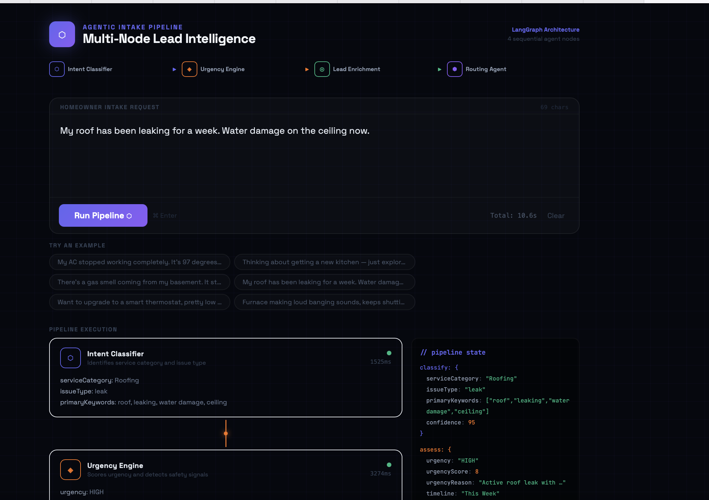
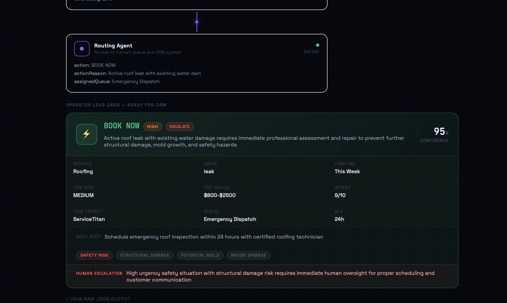

# Lead Intelligence Pipeline

Multi-node agentic intake system for home service operators. Classifies inbound requests through four sequential AI nodes — intent, urgency, enrichment, routing — and outputs a structured lead card with CRM assignment and action decision.

**Live:** https://lead-pipeline-six.vercel.app

---




---

## Architecture

Four discrete Claude API calls, each with scoped context and typed output. Each node receives prior state, building signal progressively — mirroring a LangGraph `StateGraph` pipeline.

```
Intake Request
     │
     ▼
[Intent Classifier] → serviceCategory, issueType, confidence
     │
     ▼
[Urgency Engine]    → urgency, safetyRisk, timeline, flags
     │
     ▼
[Lead Enrichment]   → estimatedValue, intentStrength, jobSize
     │
     ▼
[Routing Agent]     → action, crmTarget, SLA, escalation
     │
     ▼
Operator Lead Card
```

---

## Stack

- Vanilla HTML/JS
- Anthropic Claude API (`claude-sonnet-4-20250514`)
- Vercel serverless proxy
